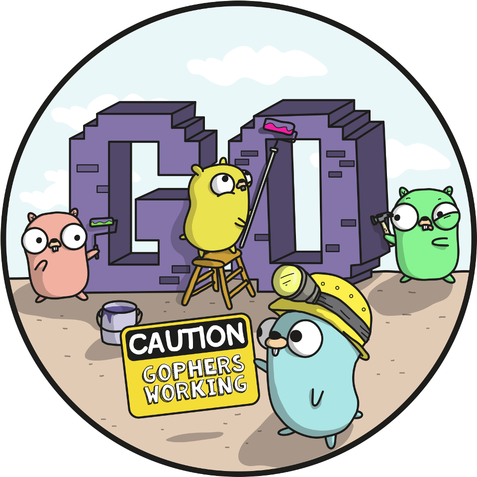
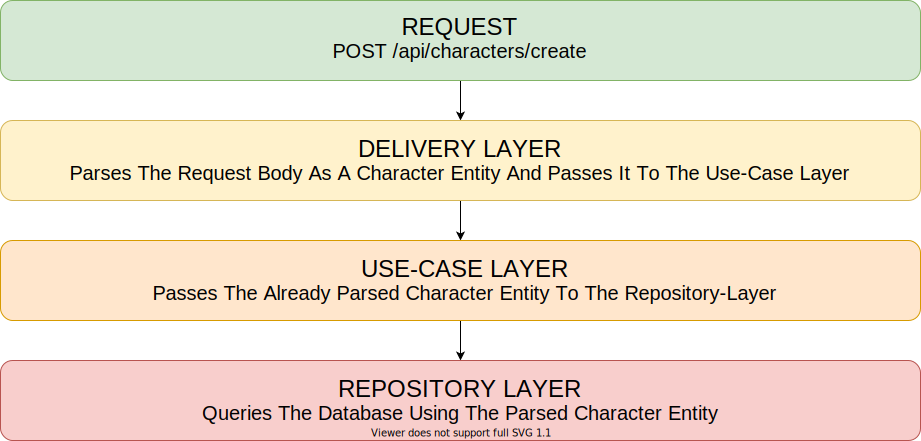

<div id="top"></div>

<!-- PROJECT LOGO -->
<br />
<div align="center">
  <a href="https://github.com/ksrof/golang-architectures">
    
  </a>

<h3 align="center">🏗️ Golang Architectures</h3>

  <p align="center">
    Exploring different types of architectures using Golang. This repo is for everyone who wants to build a solid project, to learn about software architecture patterns or to improve already existing skills. Note that the following patterns can be easly applied using any other programming language as they are agnostic, so see the language as the example implementation, but focus more on what the architecture can do for you or your project!
  </p>

  <div>
    <p align="center">
      <a href="https://github.com/ksrof/golang-architectures">
        
      </a>
      <a href="https://github.com/ksrof/golang-architectures">
        
      </a>
      <a href="https://github.com/ksrof/golang-architectures/LICENSE">
        
      </a>
      <a href="https://github.com/ksrof/golang-architectures">
        
      </a>
    </p>
  </div>
</div>

<!-- TABLE OF CONTENTS -->
<details>
  <summary>Table of Contents</summary>
  <ol>
    <li>
      <a href="#why-do-i-need-to-know-about-architecture">Why Do I Need To Know About Architectures?</a>
      <ul>
        <li><a href="#layered-architecture">Layered Architecture</a></li>
      </ul>
    </li>
    <li><a href="#built-with">Built With</a></li>
    <li><a href="#contributing">Contributing</a></li>
    <li><a href="#license">License</a></li>
    <li><a href="#contact">Contact</a></li>
  </ol>
</details>

<!-- ABOUT THE PROJECT -->

## Why Do I Need To Know About Architectures

This repo is a reference for the Go community that aims to help developers choose the right architecture for their project. Doesn't matter if you are applying the following concepts to a personal project or as part of a larger team, having the know-how about which software architecture suits better your needs is an important skill to have. Establishing good patterns which are consistent and well-known can reduce the time a developer has to waste undestanding their own (or others) code.

<p align="right">(<a href="#top">back to top</a>)</p>

<!-- ARCHITECTURES -->

### Layered Architecture

In this pattern each layer plays a distinct role within the application, the request needs to pass through the layer down below in order to get to the next layer. Layers are only responsible for what happens inside them, so you can modify one layer without messing the other.

Let's illustrate this with an example of how it would handle a request



#### 👤 User Request
The user in this case is making a (`POST`) request to the (`api/characters/create`) handler with the following data.

```json
{
  "Name": "Jaina Proudmoore",
  "Title": "Ruler of Theramore",
  "Gender": "Female",
  "Race": "Human",
  "Class": "Mage",
  "Affiliation": "Alliance",
  "Status": "Alive",
}
```

#### 📦 Delivery Layer
The (`delivery-layer`) will take the request body, parse it, perform some validations and then pass it to the (`use-case`) layer as a character entity.

Request body becomes this.
```go
type Character struct {
  Name          string `json:"name"`
  Title         string `json:"title"`
  Gender        string `json:"gender"`
  Race          string `json:"race"`
  Class         string `json:"class"`
  Affiliation   string `json:"affiliation"`
  Status        string `json:"status"`
}
```

#### 🛠️ Use-Case Layer
Once the (`use-case`) layer gets the character entity it takes whatever it needs from it and calls the (`repository-layer`).

#### 🗃️ Repository Layer
Finally the (`repository-layer`) makes an SQL query to create a new character entity record inside the database.

#### 👍 Pros And Cons Of This Architecture 👎
- Pros
  - Separation of concerns. Only needs to be considered a smaller scope in each layer, which makes solving problems much more straightforward.
  - As each layer has less things it becomes easier to write tests.
  - Changes made to one layer won't affect downstream layers.
  - If you wish to change how one layer is implemented, you are free to change it as long as it uses the same interface.
- Cons
  - If there are to many layers management can be a issue
  - The more layers you add the slower it will get


## Built With
In this repo you can find examples made with the [Net/HTTP Package](https://pkg.go.dev/net/http) that comes from the standard library, and examples made with [Gin](https://github.com/gin-gonic/gin) and [Gorm](https://gorm.io).

**Note:** The HTTP example uses an external package called [Go-SQL-Driver](https://github.com/go-sql-driver/mysql) to use MySQL. And both examples rely on [Godotenv](https://github.com/joho/godotenv) to load .env files.

- [Golang](https://golang.org)
- [Gin](https://github.com/gin/gin-gonic)
- [Gorm](https://gorm.io)

Thanks to every one who is involved on each of this projects, and to the open-source community that keeps the world running contributing with their code.

<p align="right">(<a href="#top">back to top</a>)</p>

<!-- CONTRIBUTING -->

## Contributing

Contributions are what make the open source community such an amazing place to learn, inspire, and create. Any contributions you make are **greatly appreciated**.

If you have a suggestion that would make this better, please fork the repo and create a pull request. You can also simply open an issue with the tag "enhancement".
Don't forget to give the project a star! Thanks again!

1. Fork the Project
2. Create your Feature Branch (`git checkout -b feature/AmazingFeature`)
3. Commit your Changes (`git commit -m 'Add some AmazingFeature'`)
4. Push to the Branch (`git push origin feature/AmazingFeature`)
5. Open a Pull Request

<p align="right">(<a href="#top">back to top</a>)</p>

<!-- LICENSE -->

## License

Distributed under the MIT License. See `LICENSE` for more information.

<p align="right">(<a href="#top">back to top</a>)</p>

<!-- CONTACT -->

## Contact

Kevin Suñer Ramos - [ksrof](https://github.com/ksrof) - kevinsunercontacto@gmail.com

Project Link: [https://github.com/ksrof/golang-architectures](https://github.com/ksrof/golang-architectures)

<p align="right">(<a href="#top">back to top</a>)</p>
